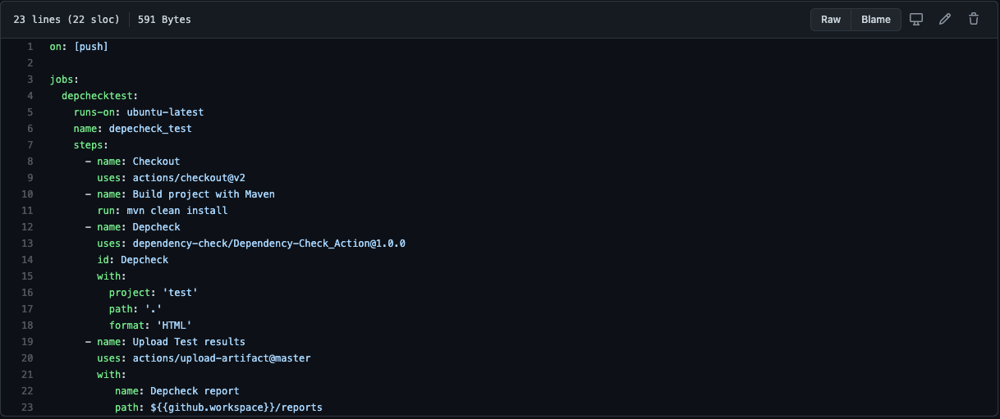
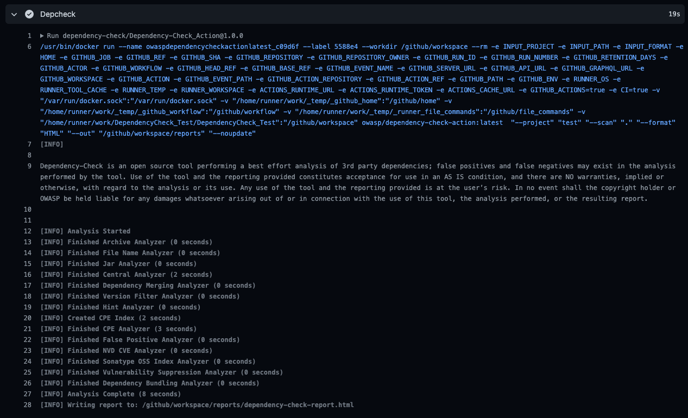
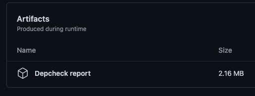
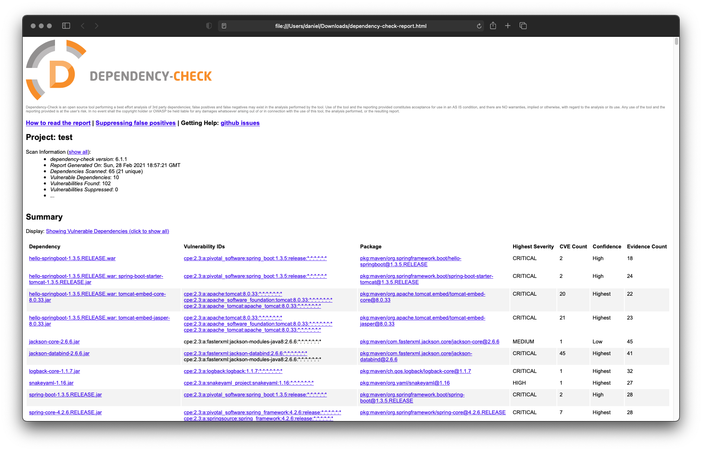

# Welcome to Dependency check action

This action uses the docker image built every night in https://github.com/dependency-check/DependencyCheck_Builder. This image includes the updated vulnerabilities database so there is no need to update it. Therefore, it speeds up the test.

# What is Dependency-Check?

This action is based upon the OWASP Dependency-Check [tool](https://owasp.org/www-project-dependency-check/), a Software Composition Analysis (SCA) tool that attempts to detect publicly disclosed vulnerabilities contained within a project’s dependencies. It does this by determining if there is a Common Platform Enumeration (CPE) identifier for a given dependency. If found, it will generate a report linking to the associated CVE entries.

# How does it work?

The action receives three parameters: Project name, scanpath and report format, but more parameters can be added as optional. 

Example:
```

on: [push]

jobs:
  depchecktest:
    runs-on: ubuntu-latest
    name: depecheck_test
    steps:
      - name: Checkout
        uses: actions/checkout@v2
      - name: Build project with Maven
        run: mvn clean install
      - name: Depcheck
        uses: dependency-check/Dependency-Check_Action@main
        id: Depcheck
        with:
          project: 'test'
          path: '.'
          format: 'HTML'    
          args: >
            --failOnCVSS 7
            --enableRetired
      - name: Upload Test results
        uses: actions/upload-artifact@master
        with:
           name: Depcheck report
           path: ${{github.workspace}}/reports
```

*args* allows to pass established flags and parameters to the binary. Check the [arguments page](https://jeremylong.github.io/DependencyCheck/dependency-check-cli/arguments.html) for valid options

# How Do I Use It?
We recommend adding the above example into your .github/workflows directory, using a name of your choice, in this example main.yml.

It should look like this



Once that action kicks off, you should be able to see it running in the actions tab.



Finally, once it has completed, a report will be generated and accessible from the actions tab



Downloading this and opening it in a browser will give you the following (for example)



# Who Is Behind It?

Dependency check action was developed by the Santander UK Security Engineering team, namely:

- [Javier Domínguez Ruiz](https://github.com/javixeneize)
